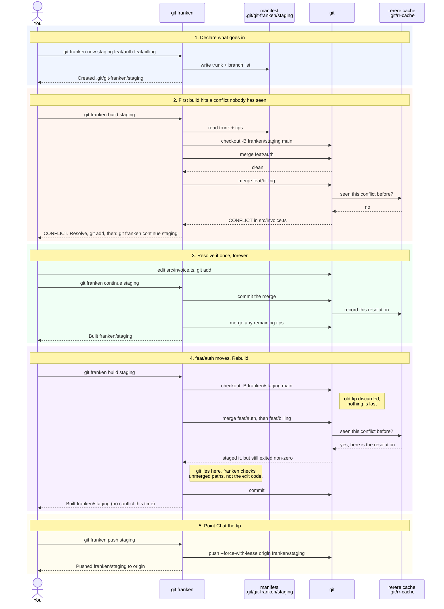

# git-franken

Rebuild disposable integration branches ("frankenbranches") from a manifest.

You have several feature branches in flight. You want **one ref** that contains
all of them, to point a test environment or CI at. Building it by hand is fine
once. It stops being fine when a branch moves and you have to re-resolve the
same conflicts you already resolved yesterday.

`git-franken` makes that rebuild cheap enough to be boring.

## The idea

**The manifest is the durable artifact. The branch is disposable output.**

The branch holds nothing the manifest can't regenerate. That has a pleasant
consequence: you never move a frankenbranch between worktrees, and you never
worry about losing one. You delete it and rebuild it wherever you want it.

Two things make the rebuild cheap:

- **Always from scratch.** Every build resets to trunk and re-merges. There is
  no incremental state to drift or repair.
- **`git rerere`.** Git records how you resolved each conflict and replays it on
  every later rebuild. You resolve a given collision roughly once, not once per
  rebuild.

## The whole interaction



Step 4 is the point of the whole tool.

## Usage

```sh
git franken new staging feat/auth feat/billing   # write a manifest
git franken build staging                        # -> branch franken/staging
git franken push staging                         # force-push for CI
```

When a branch moves, rebuild:

```sh
git franken build staging
```

Conflicts you have already resolved replay silently. A genuinely new one stops
the build and tells you what to fix:

```
CONFLICT merging 'feat/billing' into franken/staging.
Unresolved:
  src/invoice.ts

Resolve them, 'git add' each, then: git franken continue staging
Your resolution is cached, so future rebuilds replay it automatically.
```

Check whether a build has gone stale:

```sh
$ git franken show staging
branches:
  feat/auth                                merged
  feat/billing                             STALE

out of date — rebuild with: git franken build staging
```

### Commands

| Command                  | Does                                              |
| ------------------------ | ------------------------------------------------- |
| `new <name> [branch...]` | create a manifest                                 |
| `list`                   | list manifests, and whether each is built         |
| `show <name>`            | show a manifest and whether it is up to date      |
| `edit <name>`            | open a manifest in `$EDITOR`                      |
| `add <name> <branch>...` | add branches to a manifest                        |
| `rm <name> <branch>...`  | remove branches from a manifest                   |
| `build <name>`           | rebuild `franken/<name>` from scratch             |
| `continue <name>`        | resume a build after resolving a conflict         |
| `drop <name>`            | delete the branch, keep the manifest              |
| `delete <name>`          | delete the branch and the manifest                |
| `purge [--dry-run]`      | remove every `franken/*` branch and all manifests |
| `push <name> [remote]`   | force-push the branch (default remote `origin`)   |

## The manifest

Plain text, one branch per line:

```
# Integration branch: franken/staging
trunk: main
feat/auth
feat/billing
colleague/hotfix
```

Manifests live in `$GIT_COMMON_DIR/git-franken/`, so they are **shared across
all worktrees** of a repo and **never committed**. `trunk:` is optional; it
defaults to `origin/HEAD`, then `main`/`master`/`trunk`.

The directory is `git-franken/` and not `franken/` on purpose: git resolves a
ref by trying `$GIT_DIR/<refname>` before `$GIT_DIR/refs/heads/<refname>`, so a
manifest at `$GIT_DIR/franken/staging` would shadow the branch
`franken/staging` and make git report a broken ref.

## What it puts in your repo, and how to get rid of it

Everything lives inside the repo's common git dir. **Nothing is installed
globally, and your git config is never modified.**

| What                      | Where                          |
| ------------------------- | ------------------------------ |
| manifests                 | `$GIT_COMMON_DIR/git-franken/` |
| integration branches      | `refs/heads/franken/*`         |
| cached conflict solutions | `$GIT_COMMON_DIR/rr-cache/`    |

`git franken list` prints this footprint. To remove all of it:

```sh
git franken purge --dry-run   # show what would go
git franken purge             # remove it
```

`purge` leaves `rr-cache` alone, because it is not really ours: it is git's own
cache, shared with your ordinary rebases, and `git gc` prunes it automatically
(60 days for resolved conflicts, 15 for unresolved). It also never touches
branches you pushed. Deleting a remote `franken/*` branch can break somebody's
test environment, so that stays a deliberate `git push origin --delete`.

### One sharp edge worth knowing

The rerere cache is **shared with your normal git usage**, and its location is
not configurable. So a conflict you resolve during a `git franken build` will be
replayed if git meets the same conflict during an ordinary rebase.

Usually that is exactly what you want. But if you resolved something as a "just
make the integration branch compile" hack, that hack can resurface in real work.
Resolve conflicts in a frankenbranch as though you meant them, or run
`git rerere forget <path>` during the merge to drop a resolution you regret.

## Worktrees

Manifests and the rerere cache both live in the common git dir, so every
worktree sees the same manifests and the same cached resolutions. A conflict
resolved in one worktree replays in all the others.

Git only allows a branch to be checked out in one worktree at a time. Rather
than fight that, `git-franken` leans on disposability:

```
$ git franken build staging
git franken: franken/staging is checked out at /home/you/code/other-wt
Integration branches are disposable: drop it there (git franken drop staging) and
rebuild here, or just build under a different name.
```

## Install

Try it without installing anything:

```sh
nix run github:fnune/git-franken -- list
```

Install into your profile:

```sh
nix profile install github:fnune/git-franken
```

With home-manager, add the flake input:

```nix
inputs.git-franken.url = "github:fnune/git-franken";
```

and the package:

```nix
home.packages = [inputs.git-franken.packages.${pkgs.system}.default];
```

Anything named `git-franken` on `$PATH` is callable as `git franken`. Verify
with `git franken help` — **not** `git franken --help`, which git intercepts to
look for a man page that does not exist.

`git-franken` needs only `git` at runtime.

### Claude / LLM skill

`skills/building-frankenbranches/` is an [Agent
Skill](https://code.claude.com/docs/en/skills), so "build a frankenbranch" is
enough to invoke it. To install:

```sh
ln -s "$PWD/skills/building-frankenbranches" ~/.claude/skills/
```

It teaches an agent to compose manifests and resolve novel conflicts with
context on what each branch is doing, and leaves the mechanical rebuild to
`git-franken`.

## Notes and limits

- **`rerere` is not magic.** It replays a resolution when the _same_ conflict
  hunk recurs. Rebase a branch so the conflicting lines change, and you will
  resolve it once more. This is a large reduction in toil, not elimination.
- **Merges, not rebases.** Tips are merged in manifest order. A frankenbranch is
  for testing, so its history only needs to be reproducible, not pretty.
- **Never merge a frankenbranch back to trunk.** It is a build artifact. Merge
  the real branches. The `franken/` namespace exists to make that obvious to
  anyone reading the branch list.
- **rerere is forced per-invocation** with `git -c rerere.enabled=true`, so the
  tool works regardless of your git config and never modifies it. Enabling
  `rerere.enabled` globally is still worth doing, so your rebases benefit too.

## Development

```sh
nix develop          # bats, shellcheck, shfmt, formatters, hooks
bats tests/          # 39 tests
nix flake check      # tests + shellcheck + formatting, against the built package
```
