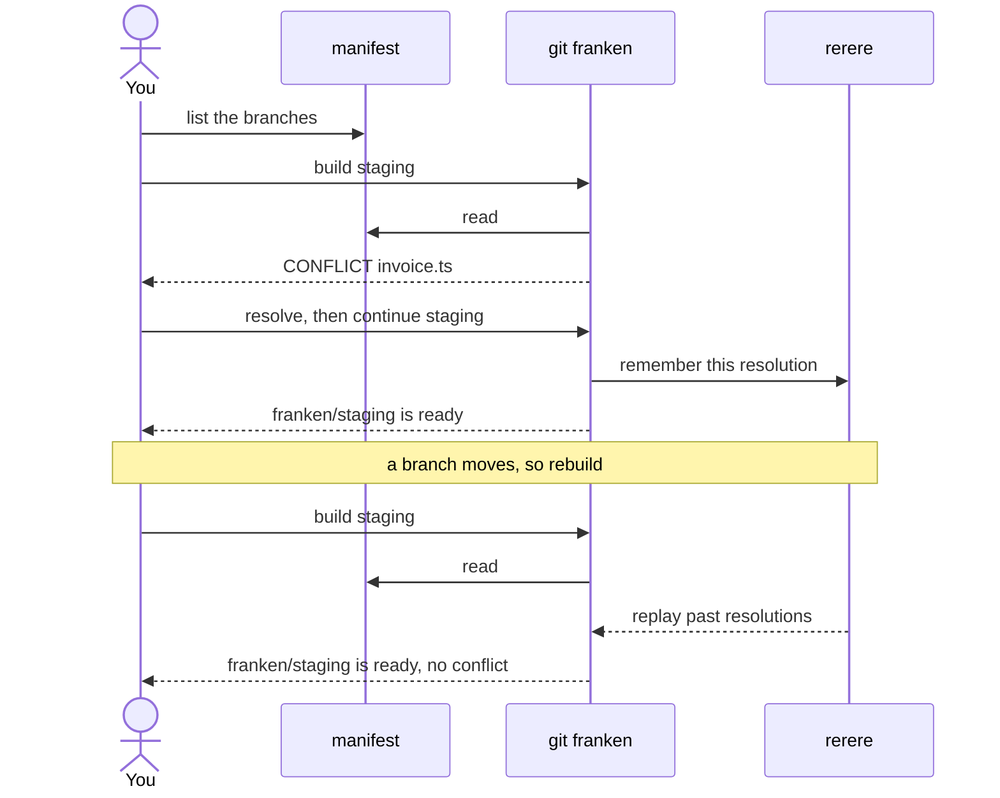

# git-franken

Rebuild disposable integration branches ("frankenbranches") from a manifest.

You have several branches in flight and want **one ref** containing all of them,
to point a test environment at. Building it by hand is fine once. It stops being
fine when a branch moves and you re-resolve yesterday's conflicts.

```sh
git franken edit staging    # declare what goes in
git franken build staging   # -> branch franken/staging
git franken push staging    # force-push for CI
```

`edit` opens a text file. You write the branches you want:

```
trunk: main
feat/auth
feat/billing
colleague/hotfix
```

When a branch moves, run `git franken build staging` again. That is the whole
workflow.

## How it works

**The manifest is durable. The branch is disposable output.**

Every build resets to trunk and re-merges from scratch, so there is no
incremental state to drift. `git rerere` replays conflicts you already resolved,
which is what makes rebuilding cheap. Resolve a collision once, not once per
rebuild.

Because the branch holds nothing the manifest can't regenerate, you never move
one between worktrees or worry about losing one. Delete it, rebuild it.

You do two things: say which branches go in, and resolve conflicts the first
time. Everything else is `build`.



The second build is the point of the whole tool: the conflict does not come
back.

## Commands

| Command                | Does                                              |
| ---------------------- | ------------------------------------------------- |
| `edit [--path] <name>` | open the manifest in `$EDITOR`, or print its path |
| `build <name>`         | rebuild `franken/<name>` from scratch             |
| `continue <name>`      | resume a build after resolving a conflict         |
| `show <name>`          | show a manifest and whether it is up to date      |
| `list`                 | list manifests and this tool's footprint          |
| `drop <name>`          | delete the branch, keep the manifest              |
| `purge [--dry-run]`    | remove every `franken/*` branch and all manifests |
| `push <name> [remote]` | force-push the branch (default remote `origin`)   |

There is deliberately no `add` or `remove`. The manifest is declarative: it is a
text file listing the state you want, and `build` reconciles to it. Adding a
branch means adding a line. `edit --path` prints the path so you can get at it
however you like:

```sh
echo feat/search >> "$(git franken edit --path staging)"
cat "$(git franken edit --path staging)"
```

`git franken show <name>` reports `STALE` when a branch has moved, so you know
whether a rebuild is needed.

## Manifests

Plain text, one branch per line, in `$GIT_COMMON_DIR/git-franken/`. Shared
across every worktree, never committed. `trunk:` is optional and defaults to
`origin/HEAD`, then `main`/`master`/`trunk`.

The store is `git-franken/` rather than `franken/` on purpose: git resolves a ref
by trying `$GIT_DIR/<refname>` before `$GIT_DIR/refs/heads/<refname>`, so a
manifest at `$GIT_DIR/franken/staging` shadows the branch `franken/staging` and
makes git report a broken ref.

## Footprint

Everything lives in the repo's common git dir. Nothing is installed globally and
your git config is never modified.

| What                      | Where                          |
| ------------------------- | ------------------------------ |
| manifests                 | `$GIT_COMMON_DIR/git-franken/` |
| integration branches      | `refs/heads/franken/*`         |
| cached conflict solutions | `$GIT_COMMON_DIR/rr-cache/`    |

`git franken list` prints this. `git franken purge --dry-run` shows what would
go; `git franken purge` removes it.

`purge` leaves `rr-cache` alone: it is git's own cache, shared with your ordinary
rebases, and `git gc` prunes it anyway. It also never deletes pushed branches,
since something may be deployed from one.

## Worktrees

Manifests and the rerere cache both live in the common git dir, so a conflict
resolved in one worktree replays in all of them.

Git allows a branch in only one worktree at a time. Rather than fight that, the
tool leans on disposability: `git franken drop` it there, rebuild here.

## Install

```sh
nix run github:fnune/git-franken -- help     # try it
nix profile install github:fnune/git-franken # install it
```

Or as a flake input:

```nix
inputs.git-franken.url = "github:fnune/git-franken";
# home.packages = [inputs.git-franken.packages.${pkgs.system}.default];
```

Anything named `git-franken` on `$PATH` is callable as `git franken`. Verify with
`git franken help` — **not** `--help`, which git intercepts to look for a man
page. The only runtime dependency is `git`.

### Agent skill

`skills/building-frankenbranches/` is an [Agent
Skill](https://code.claude.com/docs/en/skills), so "build a frankenbranch" is
enough to invoke it:

```sh
ln -s "$PWD/skills/building-frankenbranches" ~/.claude/skills/
```

## Caveats

- **rerere is not magic.** It replays a resolution when the _same_ conflict hunk
  recurs. Rebase so the conflicting lines change and you resolve it once more.
- **The rerere cache is shared with your normal git**, and its path is not
  configurable. A conflict you resolve during a build is replayed in ordinary
  rebases too. Usually welcome, but a "just make it compile" hack can resurface
  in real work. Use `git rerere forget <path>` to drop one you regret.
- **Never merge `franken/*` into trunk.** It is a build artifact. Merge the real
  branches. The namespace exists to make that obvious.

## Development

```sh
nix develop          # bats, shellcheck, shfmt, formatters, hooks
bats tests/          # 49 tests
nix flake check      # tests + shellcheck + formatting, against the built package
```
